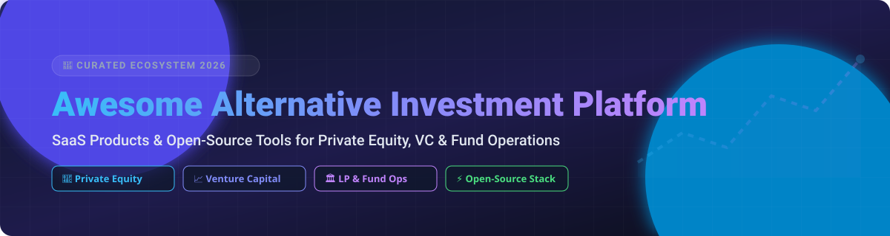

  

  
  
  
  
  

# 🚀 Awesome Alternative Investment Platform

> **A Curated Directory of Commercial SaaS Products & Open-Source Infrastructure for Private Equity, Venture Capital, LP Portals, Deal Flow & Fund Operations.**

Welcome to the definitive awesome list for **Alternative Investment Management Software** and **Private Capital Infrastructure**. This repository provides an audited guide for General Partners (GPs), Limited Partners (LPs), Fund Administrators, Wealth Managers, and Fintech Engineers evaluating solutions for fundraising, deal pipeline management, portfolio monitoring, capital call processing, and automated reporting.

*Last updated: September 2026*

---

## 📌 Table of Contents

- [📊 SaaS & Commercial Platforms](#-saas--commercial-platforms)
- [⚡ Open-Source GitHub Projects](#-open-source-github-projects)
- [🤝 How to Contribute](#-how-to-contribute)
- [💖 Support & Sponsorship](#-support--sponsorship)
- [⚖️ Disclaimer](#%EF%B8%8F-disclaimer)
- [📈 Star History](#-star-history)

---

## 📊 SaaS & Commercial Platforms

> **Market Overview:** The global alternative investment software market is valued at **~$3.5 billion in 2026** (projected to reach **$15+ billion by 2032** at a 12–16% CAGR). The market is **moderately fragmented**, featuring large enterprise technology consolidators (such as iCapital, SS&C, and ION Group) alongside agile, specialized platforms tailored for specific asset classes (private equity, venture capital, real estate, and private debt).

The table below lists leading commercial alternative investment platforms sorted by company scale (**Valuation / Revenue** descending), including exact starting tier prices and free trial availability:

| Platform / Company 🏢 | Valuation / Revenue (Scale) 💰 | Starting Tier Pricing 🏷️ | Free Tier / Trial Limits ⏳ | Focus & Primary Workflows 🎯 |
| :--- | :--- | :--- | :--- | :--- |
| **[iCapital](https://www.icapital.com/)** | **>$7.5 Billion Valuation** ($945B+ Assets Serviced) | Institutional feeder fund fee structures; custom enterprise licensing | No free tier or trial; professional advisor registration & vetting required | Wealth manager & advisor distribution platform for PE, VC & hedge funds |
| **[AngelList](https://www.angellist.com/)** | **$4.1 Billion Valuation** (~$80M–$224M ARR) | **SPVs:** ~$8,000 setup + ~$2,000 state fees (capped ~10%); **Venture Funds:** ~$10,000+ base annual admin fee + 20% carry | Free basic starter account for cap tables & founder incorporating; no free trial on full fund stack | Venture fund infrastructure, SPVs, rolling funds & startup cap tables |
| **[CAIS](https://www.caisgroup.com/)** | **>$2.0 Billion Valuation** (37% 3-Year Revenue CAGR) | Platform transaction/distribution fees + custom CAIS Solutions enterprise subscription | No free trial; free advisor education (CAIS IQ), full platform access requires institutional onboarding | Alternative investment marketplace for independent financial advisors & RIAs |
| **[Juniper Square](https://www.junipersquare.com/)** | **$1.1 Billion Valuation** ($139.8M Revenue in 2025) | Quote-based enterprise subscription; third-party reported starting tiers at **~$18,000 / year** | No free tier or trial; live personalized software demo on request | Fund administration, investor portal & GP/LP management for commercial real estate & PE |
| **[Chronograph](https://www.chronograph.pe/)** | **$350 Million Valuation** (~$23M Revenue in 2024) | Enterprise subscriptions scaled by AUM / fund count; starting tiers typically **$100,000+ / year** | No free tier or trial; sales demo & tailored proof-of-concept required | Automated portfolio monitoring, data warehousing & AI analytics for PE & LPs |
| **[Allvue Systems](https://www.allvuesystems.com/)** | **Private** (~$63.9M Revenue in 2025, withdrawn $1B+ IPO) | Custom modular enterprise subscription; estimated median contract value at **~$200,000 / year** | No free tier or trial; personalized enterprise sales demo required | Full investment lifecycle suite (front/middle/back office) for PE, credit & fund admins |
| **[Dynamo Software](https://www.dynamosoftware.com/)** | **Private** (Backed by Blackstone & Francisco Partners, ~$50M ARR est.) | Quote-based annual subscription per seat or per managed portfolio company | No free tier or trial; interactive live demo upon request | Configurable CRM, deal management & fund accounting for PE/VC managers |
| **[Backstop Solutions](https://www.backstopsolutions.com/)** | **Acquired by ION Analytics** (~$19.1M ARR pre-acquisition) | Custom enterprise quote-based license model based on module count and AUM | No free tier or trial; sales consultation & demo required | Institutional portfolio management, CRM & research management for institutional investors |
| **[InvestX](https://www.investx.com/)** | **Private** ($10M+ Revenue est.) | Management fees + performance fees (carried interest) per fund product | No free trial or software tier (regulated broker-dealer & fund manager platform) | Late-stage private equity & pre-IPO investment platform with reduced minimums |
| **[Vestberry](https://www.vestberry.com/)** | **Private** ($2.4M–$5M+ Total Funding) | Custom subscription pricing based on portfolio size and managed AUM | **Free trial available upon request** (no permanent free tier; demo required) | AI-powered portfolio intelligence, analytics & LP reporting for VC/PE funds |

---

## ⚡ Open-Source GitHub Projects

While commercial platforms dominate regulated fundraising and complex waterfall administration, open-source projects provide self-hosted solutions for deal flow tracking, LP document rooms, cap table modeling, and portfolio analytics.

The table below features notable open-source repositories sorted by **GitHub Star Count** (descending), with direct links to each project's stargazers:

| Repository 💻 | Stars ⭐ | Description & Focus 💡 |
| :--- | :--- | :--- |
| **[twentyhq/twenty](https://github.com/twentyhq/twenty)** |  | Modern open-source CRM alternative to Salesforce, highly customizable for PE/VC deal flow pipeline tracking. |
| **[maybe-finance/maybe](https://github.com/maybe-finance/maybe)** |  | Open personal finance and wealth management application providing asset & portfolio calculation engine. |
| **[frappe/erpnext](https://github.com/frappe/erpnext)** |  | Open-source enterprise resource planning (ERP) system frequently adapted for SPV accounting and investment entity ledgers. |
| **[documenso/documenso](https://github.com/documenso/documenso)** |  | Open-source document signing platform suitable for digital subscription agreements and virtual data rooms. |
| **[ghostfolio/ghostfolio](https://github.com/ghostfolio/ghostfolio)** |  | Open-source wealth management dashboard to track portfolio assets, performance, and risk metrics. |
| **[portfolio-performance/portfolio](https://github.com/portfolio-performance/portfolio)** |  | Open-source portfolio calculation and tracking tool for analyzing investment IRR, MOIC, and performance metrics. |
| **[espocrm/espocrm](https://github.com/espocrm/espocrm)** |  | Open-source CRM application customized by investment teams for relationship and deal pipeline tracking. |
| **[ciur/papermerge](https://github.com/ciur/papermerge)** |  | Open-source document management system (DMS) tailored for archiving and organizing LP due diligence data rooms. |
| **[tdavidson/reporting](https://github.com/tdavidson/reporting)** |  | **Portfolio (Hemrock)**: Open-source (Apache 2.0) operating platform for venture funds covering deal flow, portfolio reporting, fund operations, LP portals, and accounting. |
| **[vivan1211/opengp](https://github.com/vivan1211/opengp)** |  | **OpenGP**: Open-source AI intelligence platform for private equity—RAG over data rooms, portfolio analytics, and meeting transcription. |

---

## 🤝 How to Contribute

Contributions are welcome! If you know of an alternative investment SaaS product or open-source repo that should be listed:

1. **Fork** this repository. 🍴
2. **Add/Edit** entries in `README.md` following the tabular format. 📝
3. Ensure descriptions remain factual, objective, and link directly to official domains. 🔗
4. **Submit a Pull Request** with a brief summary of your addition. 🚀

---

## 💖 Support & Sponsorship

Thank you for exploring the **Awesome Alternative Investment Platform** directory! 🌟

If you find this curated list valuable for your investment operations, private market research, or fintech development:
- ⭐ **Star** this repository on GitHub to boost visibility!
- 🔀 **Fork** it to keep your own reference or submit contributions.
- 📢 **Share** it with colleagues, fund managers, and developers in private markets.

### ☕ Sponsor & Buy Me a Coffee
If you would like to support the ongoing research and maintenance of this project, consider sponsoring via GitHub Sponsors:

---

## ⚖️ Disclaimer

- This is a **community-curated index** for informational purposes only—it does not constitute financial, legal, or investment advice.
- Alternative investment workflows are strictly governed by securities regulations, fiduciary duties, and compliance standards (AML/KYC, FATCA, SEC, AIFMD). Software tools do not replace qualified legal counsel or certified fund administrators.
- Open-source implementations offer complete data ownership but require in-house operational, compliance, and security oversight.

---

## 📈 Star History

